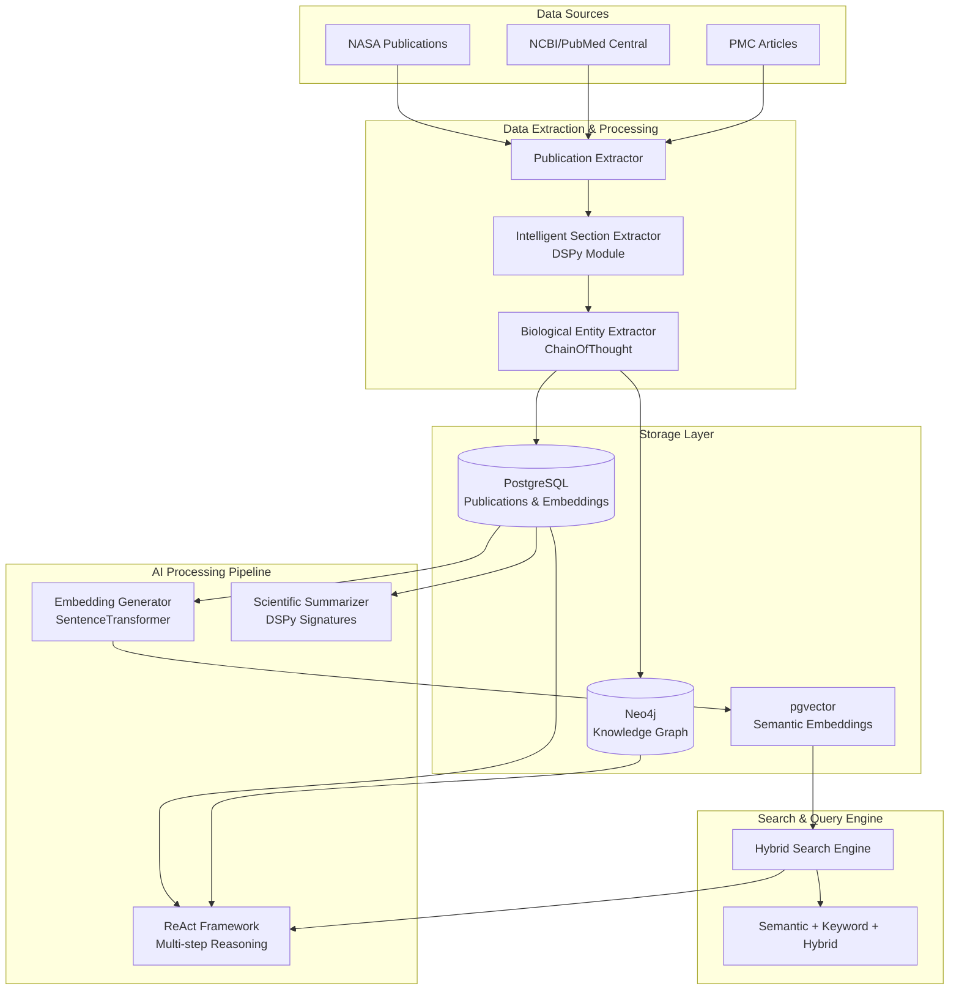
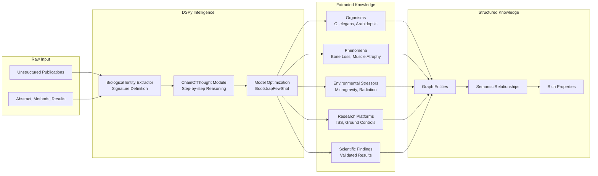
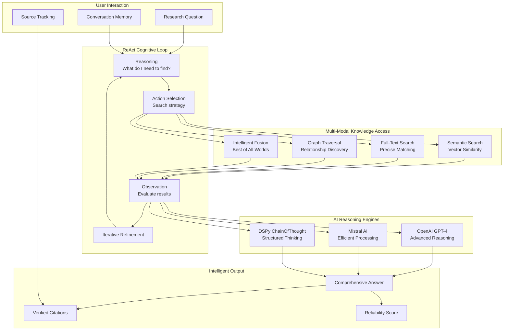
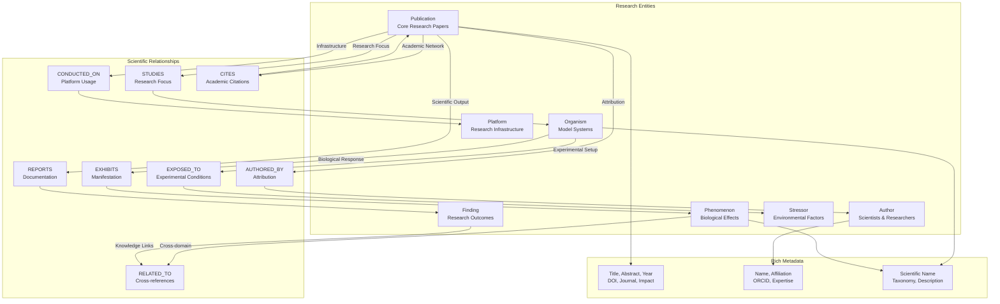
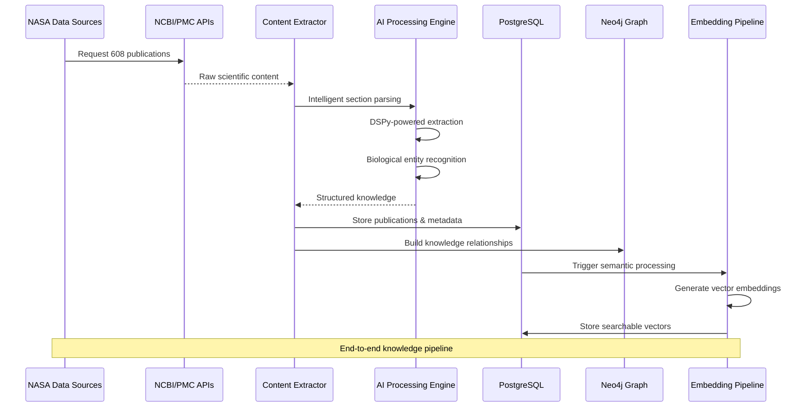
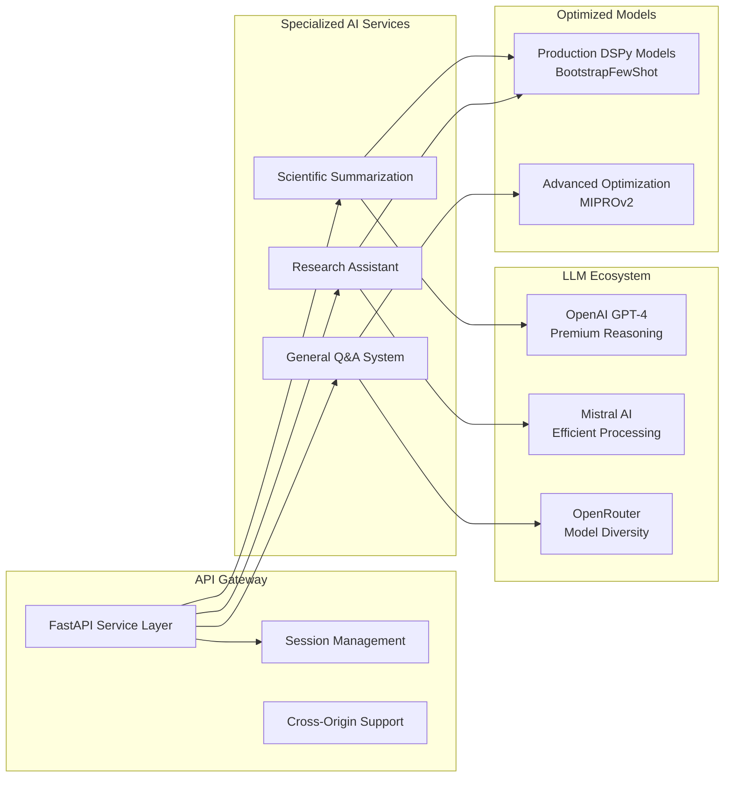
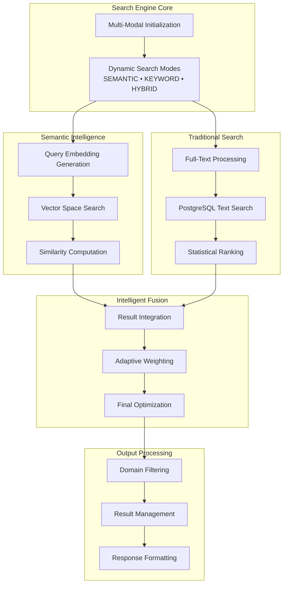
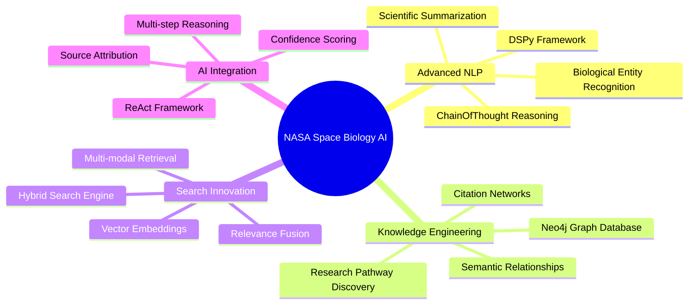

# NASA Space Biology Knowledge Graph - Technical Journey

## 1. Overall System Architecture

## 2. DSPy-Powered Entity Extraction Journey

## 3. Advanced RAG with ReAct Framework

## 4. Semantic Search Innovation

```mermaid
graph LR
    subgraph "Content Processing"
        DOCS[608 NASA Publications]
        CHUNKS[Intelligent Chunking]
        CLEAN[Content Normalization]
    end
    
    subgraph "Neural Embeddings"
        ST[SentenceTransformer<br/>all-MiniLM-L6-v2]
        VECTORS[768-dimensional Vectors]
        BATCH[Optimized Batch Processing]
    end
    
    subgraph "Vector Database"
        PGVECTOR[PostgreSQL + pgvector]
        INDEX[HNSW Indexing]
        COSINE[Cosine Similarity Search]
    end
    
    subgraph "Search Innovation"
        SEM[Pure Semantic<br/>Conceptual Understanding]
        FTS[Traditional Keyword<br/>Exact Matching]
        HYB[Hybrid Fusion<br/>Intelligent Combination]
    end
    
    subgraph "Result Intelligence"
        RANK[Advanced Ranking]
        SCORE[Relevance Scoring]
        FILTER[Domain-Specific Filters]
    end
    
    DOCS --> CHUNKS
    CHUNKS --> CLEAN
    CLEAN --> ST
    ST --> VECTORS
    VECTORS --> BATCH
    BATCH --> PGVECTOR
    PGVECTOR --> INDEX
    INDEX --> COSINE
    
    COSINE --> SEM
    PGVECTOR --> FTS
    SEM --> HYB
    FTS --> HYB
    
    SEM --> RANK
    FTS --> RANK
    HYB --> RANK
    RANK --> SCORE
    SCORE --> FILTER
```

## 5. Knowledge Graph Schema Design

## 6. Data Processing & ETL Journey

## 7. AI Service Ecosystem

## 8. Hybrid Search Engine Intelligence

## 9. Innovation Highlights

